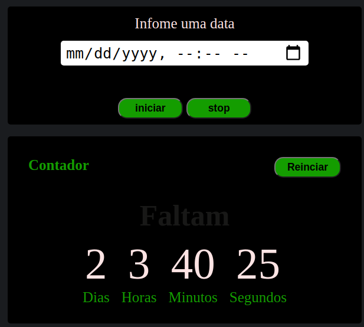
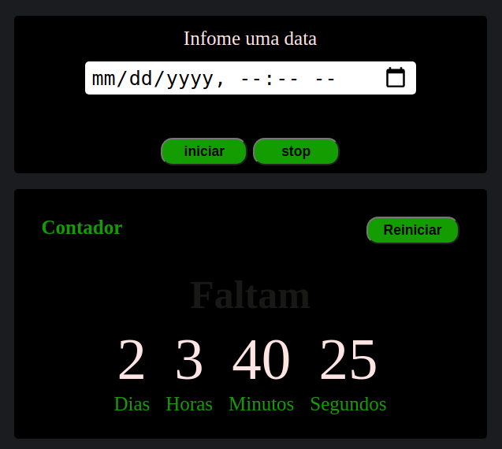

# Contador

## Atenção
O botão "Reiniciar" é uma função recursiva que chama ela mesmas, no qual, irá aparece uma caixa de confirmação infinitamente. Os demais botões funcionam corretamente com suas devidas atribuições.

### Page
[Click aqui e veja uma Demo](https://leltonborges.github.io/contador-js/)
